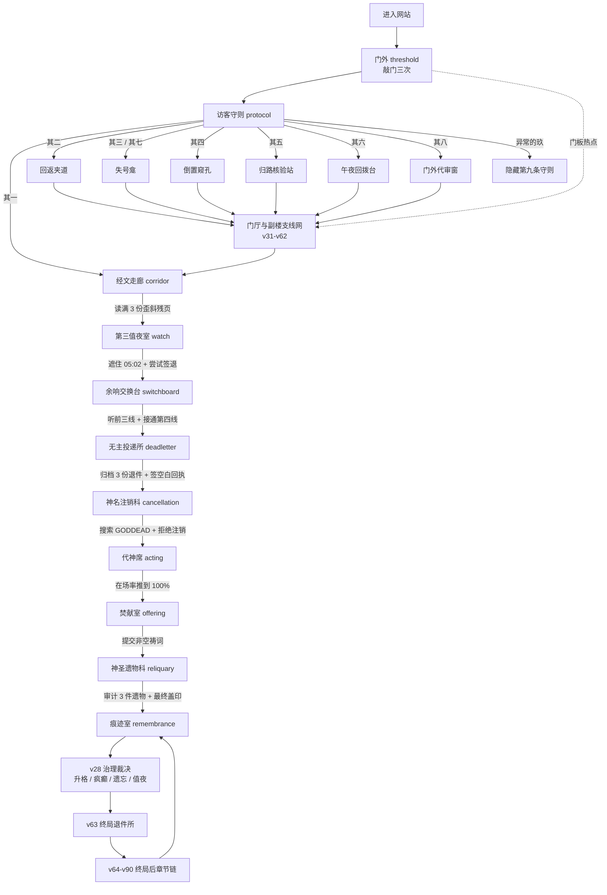
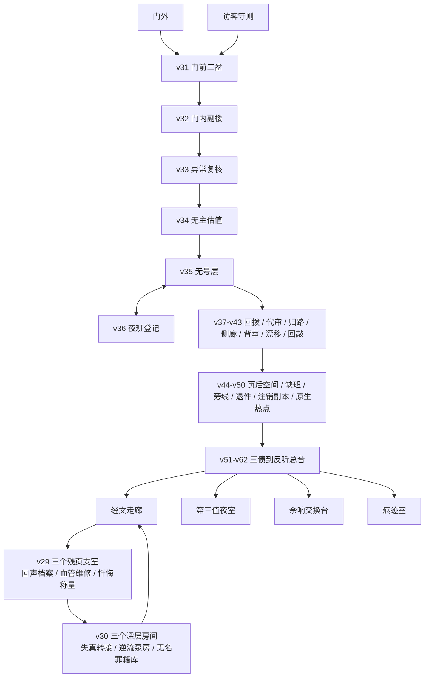
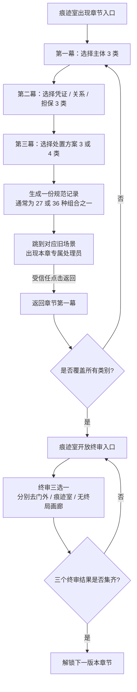
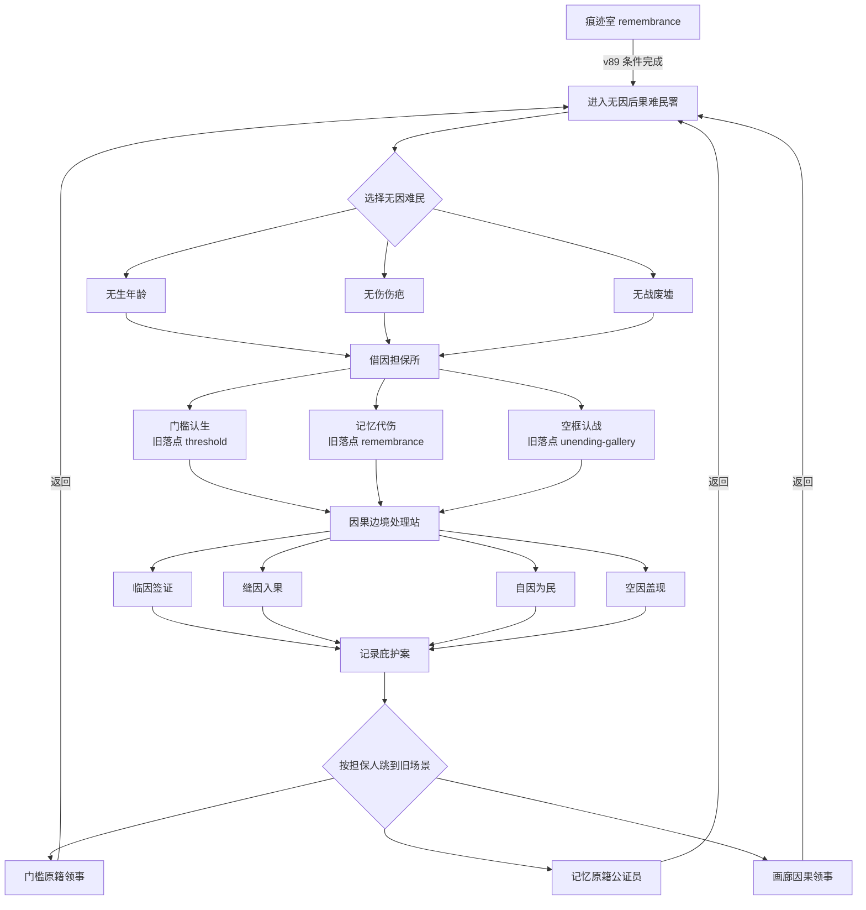
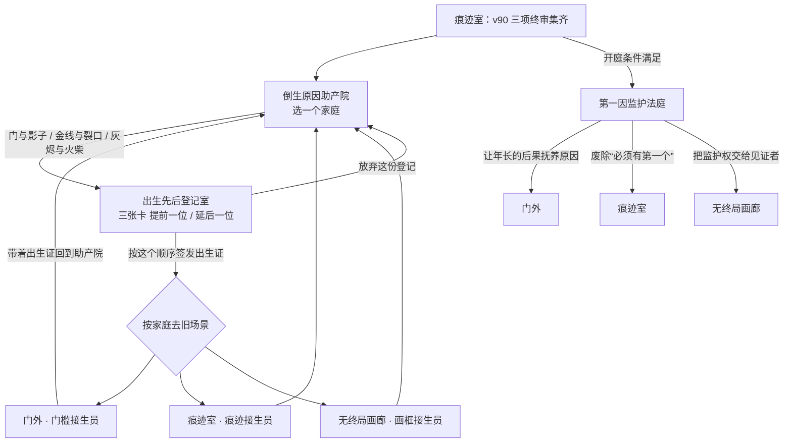
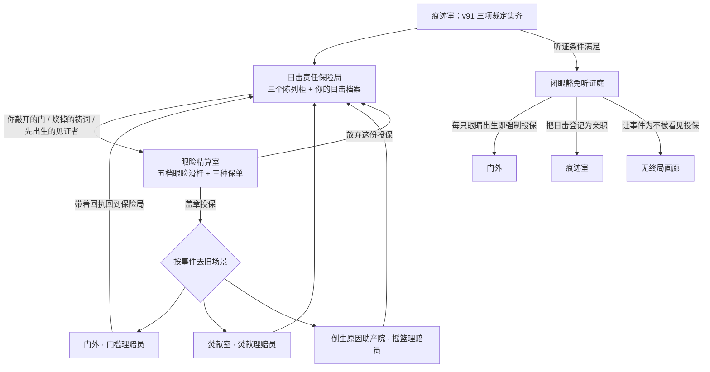
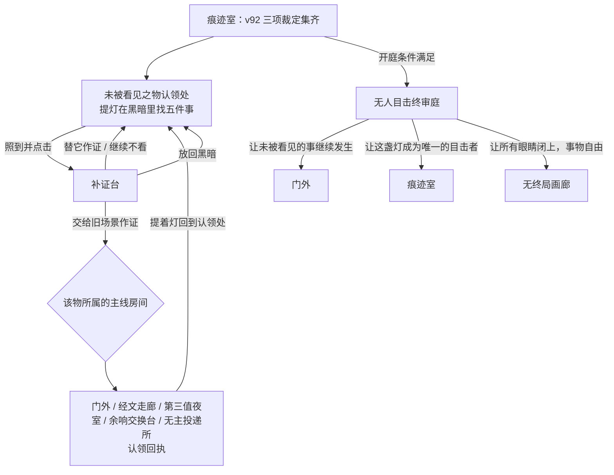
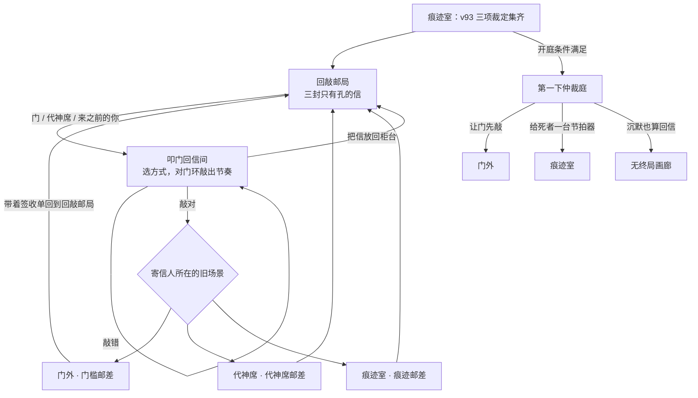

# Goddead 当前游玩流程图

版本基线：v94

场景总数：205
关键枢纽：`threshold`（门外）、`corridor`（经文走廊）、`remembrance`（痕迹室）、`unending-gallery`（无终局画廊）

这份文档按玩家实际体验拆成四层：基础主线、门厅支线网、终局后章节链、当前最新 v90–v94。源码里的 205 个场景并不是一条直线；`remembrance` 是后半程章节入口与终审入口的总枢纽，多个旧场景会在新章节中被重新征用为回桥。

## 1. 一眼看懂整局

## 2. 基础主线怎么走

1. 在 `threshold` 连续完成三次敲门。第三次后门体开启，自动进入 `protocol`。
2. `protocol` 的八条守则已经变成真实分流器。想走最短主线选“其一”；其二至其八会进入门厅支线、核验、回拨或代审系统；异常数字“玖”进入隐藏场景，不参与自动循环。
3. 到 `corridor` 后读满三份残页，解锁 `watch`。残页上的回声、血管、忏悔还会开启 v29 三个可选支室。
4. 在 `watch` 同时满足“处理 05:02 交班记录”和“至少尝试签退一次”，第四线路才会出现。
5. `switchboard` 先听完前三条回拨，再接通第四线；`deadletter` 归档三份退件并签收空白件；`cancellation` 搜索 `GODDEAD` 后拒绝注销；`acting` 把在场率推到 100%。
6. `offering` 接受一条非空祷词后点燃焚化炉；`reliquary` 完成三件遗物审计与最终盖印，进入 `remembrance`。
7. `remembrance` 会显示已经开放的章节、图鉴、旧场景回桥和终审入口。后半程游玩基本都从这里出发，再回到这里结算。

### v28 治理终局判定

代神席、焚献室、遗物科各做一次甲 / 乙裁决。起始数值为灵质 E=50、灰烬 A=50、共鸣 R=20，每次裁决后夹在 0–100。

| 裁决 | 甲 | 乙 |
| --- | --- | --- |
| 代神席 | E+20 A−15 R+15 | E−15 A+10 R−5 |
| 焚献室 | E−15 A+25 R−10 | E+20 A−20 R+20 |
| 遗物科 | E+10 A+10 R−15 | E−20 A−20 R+40 |

判定顺序：E≤0、A≤0 或 R≥100 为崩解；否则 E≥70 且 E 最高为登神；R≥50 且 R 不低于其余两项为疯癫；A≥60 且 A>E 为归寂；其余为值夜。八种组合的结果：

| 代神 / 焚献 / 遗物 | E · A · R | 结局 |
| --- | --- | --- |
| 甲 · 甲 · 甲 | 65 · 70 · 10 | 灰烬归寂 `oblivion` |
| 甲 · 甲 · 乙 | 35 · 40 · 65 | 万魂共鸣 `madness` |
| 甲 · 乙 · 甲 | 100 · 25 · 40 | 登神长阶 `ascension` |
| 甲 · 乙 · 乙 | 70 · 0 · 95 | 崩解 |
| 乙 · 甲 · 甲 | 30 · 95 · 0 | 灰烬归寂 `oblivion` |
| 乙 · 甲 · 乙 | 0 · 65 · 45 | 崩解 |
| 乙 · 乙 · 甲 | 65 · 50 · 20 | 永恒值夜 `nightwatch` |
| 乙 · 乙 · 乙 | 35 · 20 · 75 | 万魂共鸣 `madness` |

v63 的“未终门”要求四种结局各至少有一份退件处理，因此至少需要四轮不同的裁决。

## 3. 门厅与副楼支线网（v29-v62）

这部分以探索、重复轮次、条件回流为主。v29-v30 是走廊残页下面的三条纵深支线；v31 起把门外、守则板、夹道、副楼和值班系统织成一张可循环网络。多数支线不会卡住基础主线，但会留下独立存档、目录入口和痕迹记录。

### 支线版本索引

| 版本 | 玩家主要在做什么 | 结果与回流 |
| --- | --- | --- |
| v29 前段多分支 | 从回声、血管、忏悔三份残页进入三个支室 | 返回门外、守则或走廊；访问记录永久保留 |
| v30 深层互联 | 从三个支室继续深入转接室、泵房、罪籍库 | 三个深层房间互相连通，并按值夜室解锁状态回流 |
| v31 门前三岔 | 点击门板日蚀、符号、回来痕迹，或使用守则分流 | 建立倒置窥孔、失号龛、回返夹道三角网 |
| v32 门内副楼 | 从 v31 的三个场景各进入一层副楼 | 闭目档案、无号前厅、逆向阶井继续互联 |
| v33 异常复核 | 三个案卷各作“异常 / 原案”判断 | 3 分进保全库，2 分回入口，0-1 分进误报井 |
| v34 无主估值 | 估值三件遗物，管理估值额与封印完整 | 达标进定额电梯；不足或破封走不同回流 |
| v35 无号层 | 在无铃病房、渗水档案、逆照洗衣中完成两间值班 | 按 `signal - debt` 分成高位、复核、债务三档 |
| v36 夜班登记 | 每轮领取静音铃、空白名或逆向证之一 | 修改 v35 的信号 / 门债，使三档都能正常到达 |
| v37 午夜回拨 | 接两条夜线，并去相应值班房现场回报 | 两线组合决定去复核、窥孔或回返夹道 |
| v38 门外代审 | 审问三名夜访者并逐一裁定 | 由裁定结果把玩家送回门厅网络 |
| v39 归路核验 | 选择两条归路并判断其证据 | 审核结果决定安全回流或异常路线 |
| v40 门外侧廊 | 从门左右两侧进入灯廊、影廊与铰链场景 | 横向接回门外、守则和内部网络 |
| v41 守则背室 | 从守则板进入三间后台房 | 为守则来源、空名和铃声建立更多回桥 |
| v42 守则漂移 | 连续检查四条漂移守则 | 正确连胜与误报分别改变返回位置 |
| v43 门内回敲网 | 在三个回敲场景处理反向敲击 | 把门外、守则和走廊再次串成闭环 |
| v44 页后空层 | 进入残页背后的纸页空间 | 扩大走廊残页的可探索纵深 |
| v45 未到交班 | 处理缺席的换班者与空位 | 将值夜、交班和回拨网络接回主线 |
| v46 旁线未静 | 重访回声、血管、忏悔的余响 | 旧支线获得新的听取与回应层 |
| v47 退件未止 | 追踪投递所退件留下的后续地址 | 连接退件、地址和返回线路 |
| v48 注销留副 | 处理注销后仍存在的副本 | 连接神名注销与身份副本网络 |
| v49 门前实感 | 在旧门厅画面上使用原生物件热点 | 旧场景从按钮清单转为画面内探索 |
| v50 副楼实感 | 在副楼画面上使用原生物件热点 | 为后续“三债”提供可触摸入口 |
| v51 副楼三债 | 在副楼动作中累积见证、失号、逆行三种债 | 每种债到阈值后显出专属异常入口 |
| v52 三债结算 | 对三种副楼债进行独立结算 | 将结果写回副楼网络，不改旧版本状态 |
| v53 归路信念污染 | 房间开始根据玩家过去路线“相信”出口 | 同一房间会因历史选择给出不同回流 |
| v54 迫近回访 | 离开视线后的房间发生位移 | 回访时用位置变化推进下一层异常 |
| v55 失常交班 | 无号层把异常作为交班记录上报 | 将房间状态送往证据与值班网络 |
| v56 症状交接 | 证据反过来审核见证人 | 形成症状、证据、见证三者的交接闭环 |
| v57 判词后果层 | 给裁决结果分配可承受它的“身体” | 裁决从文本变成可继续追踪的后果 |
| v58 异议总署 | 对前述判词提出和登记异议 | 将争议送入正式听证链 |
| v59 交叉听证 | 多份证词互相质询 | 产出可进入证物链的听证记录 |
| v60 证物链 | 为听证结果建立保管与流转顺序 | 证物去向决定后续故障重演入口 |
| v61 故障重演 | 重放一次失败的处理流程 | 把错误转成可监听、可追责的信号 |
| v62 反听总台 | 三条旧旁线各提交一次回应，组合成 27 种监听结果 | 结算后回到主网络；也成为 v63 无终局画廊的反向出口 |

## 4. 终局后章节链（v63-v90）

```mermaid
flowchart TD
    V28[v28 四类治理终局] --> V63[v63 终局退件所\n12 coda + 无终局]
    V63 --> V64[v64 因果倒邮\n12 后果 + 3 零号结局]
    V64 --> V65[v65 因果疤痕\n12 处理 + 3 病房结局]
    V65 --> V66[v66 反事实纺生]
    V66 --> V67[v67 无血家谱]
    V67 --> V68[v68 世代借贷]
    V68 --> V69[v69 死后人口普查]
    V69 --> V70[v70 亡者议会]
    V70 --> V71[v71 死亡外交部]
    V71 --> V72[v72 遗言中央银行]
    V72 --> V73[v73 梦境海关]
    V73 --> V74[v74 墓碑专利局]
    V74 --> V75[v75 末日保修局]
    V75 --> V76[v76 现实退款处]
    V76 --> V77[v77 自我真伪鉴定]
    V77 --> V78[v78 第一人称配给]
    V78 --> V79[v79 未言人格继承]
    V79 --> V80[v80 未遂思想收容]
    V80 --> V81[v81 后悔回收]
    V81 --> V82[v82 宽恕填埋]
    V82 --> V83[v83 伤害考古]
    V83 --> V84[v84 无罪证人保护]
    V84 --> V85[v85 孤事实认领]
    V85 --> V86[v86 存在放弃登记]
    V86 --> V87[v87 不存在债务催收]
    V87 --> V88[v88 未发生事件拍卖]
    V88 --> V89[v89 既成事实拆迁]
    V89 --> V90[v90 无因后果难民署]
    V90 --> V91[v91 倒生原因助产院]
    V91 --> V92[v92 目击责任保险局]
    V92 --> V93[v93 未被看见之物认领处]
    V93 --> V94[v94 回敲邮局]
```

### 后半程共通玩法

v66 之后的大多数章节都采用同一个可学习的循环：

玩家通常不需要先刷满全部 36 种组合：先用最少的代表记录覆盖所有第一、第二、第三层类别，就能开放本章终审；但下一章通常还要求本章三个终审结果全部集齐。图鉴全收集则需要补满本章全部组合。

| 版本段 | 组合规模 | 章节完成条件 | 场景数到达 |
| --- | ---: | --- | ---: |
| v63 | 4 个旧终局 × 3 种处理 = 12 | 四种旧终局各至少一份 coda，开放第 13 个“无终局” | 89 |
| v64 | 3 种邮寄模式 × 4 个旧落点 = 12，再加 3 个零号结局 | 四个落点都收到后果，再完成零号结局 | 92 |
| v65 | 4 个旧场景 × 3 种疤痕处理 = 12，再加 3 个病房结局 | 覆盖四处疤痕与三种处理（至少 4 条）并集齐三个病房结局，即开放 v66 | 93 |
| v66-v67 | 36 + 3 | 覆盖 4×3×3，再集齐三个终局 | 97 / 101 |
| v68-v69 | 27 + 3 | 覆盖 3×3×3，再集齐三个终局 | 105 / 109 |
| v70-v90 | 每章通常 36 + 3 | 覆盖 3×3×4，再集齐三个终审结果 | v70 113，之后每版 +4，v90 为 193 |
| v91 | 3 家庭 × 6 顺序 = 18，再加 3 个监护裁定 | 三个家庭各一份、原因在前与后果在前各一份、见证者排第一一份，即开庭；三项裁定为终局收集 | 196 |
| v92 | 3 事件 × 3 保单 = 9，再加 3 个豁免裁定 | 三件事都投保、三种保单都用过、一次闭眼、一次凝视，即开听证；三项裁定为终局收集 | 199 |
| v93 | 5 物 × 3 方式 = 15，再加 3 个无人目击裁定 | 五件事都认领、三种方式都用过，即开庭；只有“交给旧场景作证”要跑主线房间 | 202 |
| v94 | 3 信 × 3 回敲方式 = 9，再加 3 个仲裁 | 三封信都回过、三种方式都用过，即开庭；每封回信按节奏敲对才寄出 | 205 |

### 逐章明细（v63-v90）

以下选项名、旧场景回桥与终审落点取自 `script.js` 各章 `*_TABLE` 常量与 `index.html` 按钮标签。带 `→` 的选项会把记录送到对应旧场景；“处理员”是该旧场景里本章专属的返回按钮。

### v63 终局退件所 / ENDING RETURN

- 规模：12 + 1；新场景：终局退件所、无终局陈列廊
- 解锁：拿到任一 v28 治理终局后，结局卡上出现“把这个结局退回去”。
- 备注：4 × 3 = 12 份 coda（如 借位登神、退回耳内、错投记忆）。四种终局各至少一份后，后墙四盏灯亮起，开“未终门”进入第 13 项“无终局”。

| 轴 | 选项 |
| --- | --- |
| 基础终局 · 4 | 登神长阶；万魂共鸣；灰烬归寂；永恒值夜 |
| 处置 · 3 | 签收；退回；误投 |
| 无终局画廊出口 · 3 | 开端之门 → 门外 `threshold`；档案痕迹 → 痕迹室 `remembrance`；倒行阶 → 反听总台 `listening-back-console` |

### v64 因果倒邮 / THE ENDING ARRIVED EARLY

- 规模：12 + 3；新场景：因果倒邮台、第一稿保管库、第一敲之前
- 解锁：v63 的“无终局”已解锁；痕迹室出现“把无终局寄回最初”。
- 备注：四个落点都投递过一次后，第一稿保管库开“第零版”，进入第一敲之前。

| 轴 | 选项 |
| --- | --- |
| 倒邮方式 · 3（需 v63 拥有对应处置） | 签收 · 先到的回执；退回 · 退回第一敲；误投 · 错投门内 |
| 早期落点 · 4（旧场景显露未来邮签） | 门外 `threshold`；访客守则 `protocol`；第三值夜室 `watch`；焚献室 `offering` |
| 零号结局（第一敲之前） · 3 | 未死回声 → 门外 `threshold`；预先死亡 → 痕迹室 `remembrance`；先于来访 → 访客守则 `protocol` |

### v65 因果疤痕 / THE CAUSE LEFT A SCAR

- 规模：12 + 3；新场景：无因收容室
- 解锁：某落点在 v64 收到任一种倒邮后果，该旧场景就出现疤痕舞台；四处各处理一次后痕迹室出现入口。
- 备注：这一章只有一个新场景，其余玩法长在四个旧场景的变异图里。

| 轴 | 选项 |
| --- | --- |
| 疤痕所在旧场景 · 4 | 门外 · 缝回第一敲 → 门外 `threshold`；守则 · 第零条缝线 → 访客守则 `protocol`；值夜 · 交班缝合 → 第三值夜室 `watch`；焚献 · 祷词续火 → 焚献室 `offering` |
| 处理 · 3 | 缝合起因 → 因果倒邮台 `causal-sorter`；放尽后果 → 痕迹室 `remembrance`；移植见证 → 第一稿保管库 `first-draft-vault` |
| 无因结局 · 3 | 你成为原因 → 门外 `threshold`；无物使你发生 → 痕迹室 `remembrance`；结局收养了你 → 无终局陈列廊 `unending-gallery` |

### v66 反事实纺生 / COUNTERFACTUAL LIVES

- 规模：36 + 3；新场景：反事实纺锤室、疤痕织机、未活育婴室、无因生涯陈列间
- 解锁：v65 的疤痕处理覆盖四处疤痕与三种处理（最少 4 条），并集齐 3 个无因结局。

| 轴 | 选项 |
| --- | --- |
| 起点 · 4 | 门前未生；守则所写；夜班留名；灰中留位 |
| 处理 · 3 | 缝骨；尽果；植证 |
| 归属 · 3 | 成因生；后果生；终局养 |
| 元结局 · 3 | 群生着身 → 门外 `threshold`；未生自葬 → 痕迹室 `remembrance`；纺锤不眠 → 无终局陈列廊 `unending-gallery` |

### v67 无血家谱 / BLOODLESS GENEALOGY

- 规模：36 + 3；新场景：反事实宗谱厅、无血档案库、借来童年室、末代家族庭
- 解锁：v66 覆盖齐全 + 三个元结局。

| 轴 | 选项 |
| --- | --- |
| 祖根 · 4（回 v66 房间） | 纺锤为根 → 反事实纺锤室 `counterfactual-spindle`；疤痕为根 → 疤痕织机 `scar-loom`；摇篮为根 → 未活育婴室 `unlived-nursery`；无因为根 → 无因生涯陈列间 `life-without-cause` |
| 亲属 · 3 | 晚祖；异生；先裔 |
| 童年 · 3 | 留年；换年；退年 |
| 家族终局 · 3 | 众生认祖 → 门外 `threshold`；后代继承你 → 痕迹室 `remembrance`；万世成孤 → 无终局陈列廊 `unending-gallery` |

### v68 世代借贷 / GENERATION LOANS

- 规模：27 + 3；新场景：世代信贷所、寿命典当库、死期清算厅、年岁止赎庭
- 解锁：v67「无血家谱」覆盖所有类别，且三项终审结果全部集齐。

| 轴 | 选项 |
| --- | --- |
| 时代 · 3 | 逝代作保 → 门外 `threshold`；同代共债 → 痕迹室 `remembrance`；后世预支 → 无终局陈列廊 `unending-gallery` |
| 抵押 · 3 | 借走七年；借走死期；借走葬礼 |
| 条款 · 3 | 童年付息；出生即偿；债传后代 |
| 止赎 · 3 | 收走当下 → 门外 `threshold`；让死亡破产 → 痕迹室 `remembrance`；让葬礼继承家族 → 无终局陈列廊 `unending-gallery` |

### v69 死后人口普查 / POSTHUMOUS CENSUS

- 规模：27 + 3；新场景：死后普查厅、矛盾证据库、出生投票间、人口注销庭
- 解锁：v68「世代借贷」覆盖所有类别，且三项终审结果全部集齐。

| 轴 | 选项 |
| --- | --- |
| 选民 · 3（回 v68 房间） | 逝代点名 → 寿命典当库 `lifetime-pawn-vault`；同代旁证 → 世代信贷所 `generational-credit-office`；后世预投 → 死期清算厅 `mortality-clearing-house` |
| 证据 · 3 | 出生证明；他人记忆；空白户籍 |
| 计票 · 3 | 计作已出生；计作从未出生；把出生记给别人 |
| 注销庭 · 3 | 追认这次出生 → 门外 `threshold`；把来访者移出人口 → 痕迹室 `remembrance`；让空白户籍成为公民 → 无终局陈列廊 `unending-gallery` |

### v70 亡者议会 / DEAD PARLIAMENT

- 规模：36 + 3；新场景：亡者议会、公民权议案厅、宪法分籍台、三人共和国
- 解锁：v69「死后人口普查」覆盖所有类别，且三项终审结果全部集齐。

| 轴 | 选项 |
| --- | --- |
| 选区 · 3（回 v69 房间） | 迟生者选区 → 出生投票间 `birth-ballot-booth`；被移除者反对席 → 死后普查厅 `posthumous-census-hall`；空白公民席 → 矛盾证据库 `contradictory-evidence-archive` |
| 议案 · 4 | 姓名权；影子权；肉身权；一次死亡权 |
| 归属 · 3 | 归姓名；归影子；归肉身 |
| 宪政危机 · 3 | 让姓名成为唯一公民 → 门外 `threshold`；让影子另组反对共和国 → 痕迹室 `remembrance`；让肉身废除死者选举 → 无终局陈列廊 `unending-gallery` |

### v71 死亡外交部 / DEATH DIPLOMACY

- 规模：36 + 3；新场景：死亡外交部、不存在国境署、条约解剖台、未宣战室
- 解锁：v70「亡者议会」覆盖所有类别，且三项终审结果全部集齐。

| 轴 | 选项 |
| --- | --- |
| 使团 · 3 | 无身姓名使团；流亡影子使团；无名肉身领事团 |
| 对方国家 · 3 | 出生以前的国 → 反事实纺锤室 `counterfactual-spindle`；记忆以后的共和国 → 痕迹室 `remembrance`；肉身内部的国 → 宪法分籍台 `constitutional-severance-desk` |
| 条款 · 4 | 互相承认；庇护未活之人；禁运复活；引渡结局 |
| 战争 · 3 | 把所有边境移进肉身 → 门外 `threshold`；只承认流亡者 → 痕迹室 `remembrance`；把复活列为跨境罪 → 无终局陈列廊 `unending-gallery` |

### v72 遗言中央银行 / LAST WORD CENTRAL BANK

- 规模：36 + 3；新场景：遗言中央银行、未言货币铸造局、遗嘱清算金库、主权违约庭
- 解锁：v71「死亡外交部」覆盖所有类别，且三项终审结果全部集齐。

| 轴 | 选项 |
| --- | --- |
| 货币 · 3 | 无主签名钞；无人注视黑币；未言遗嘱债 |
| 储备 · 3 | 最后一口气 → 门外 `threshold`；继承来的沉默 → 痕迹室 `remembrance`；抵押一段结局 → 无终局陈列廊 `unending-gallery` |
| 政策 · 4 | 先于说出口；让告别贬值；冻结复活流动性；他人口中赎回 |
| 违约 · 3 | 国有化所有遗言 → 痕迹室 `remembrance`；让沉默决定利率 → 无终局陈列廊 `unending-gallery`；宣布死亡大到不能倒闭 → 门外 `threshold` |

### v73 梦境海关 / BORROWED DREAM CUSTOMS

- 规模：36 + 3；新场景：梦境海关总署、违禁睡眠申报厅、噩梦关税局、清醒驱逐场
- 解锁：v72「遗言中央银行」覆盖所有类别，且三项终审结果全部集齐。

| 轴 | 选项 |
| --- | --- |
| 护照 · 3 | 神死前旧梦；未生者睡签；未来证人夜证 |
| 违禁品 · 3 | 醒时未见之脸 → 闭目档案室 `eyelid-archive`；醒后续梦记忆 → 痕迹室 `remembrance`；无梦者结局 → 无终局陈列廊 `unending-gallery` |
| 关税 · 4 | 以清醒年岁征税；没收做梦者；把梦退运给死亡；给予噩梦庇护 |
| 驱逐 · 3 | 让所有噩梦成为公民 → 痕迹室 `remembrance`；把做梦者驱逐出梦 → 闭目档案室 `eyelid-archive`；把清醒列为违禁品 → 门外 `threshold` |

### v74 墓碑专利局 / TOMBSTONE PATENT OFFICE

- 规模：36 + 3；新场景：墓碑专利局、先前技术骨库、不可实现权项审查室、永久许可终审庭
- 解锁：v73「梦境海关」覆盖所有类别，且三项终审结果全部集齐。

| 轴 | 选项 |
| --- | --- |
| 申请人 · 3 | 未生发明人；死后署名人；未来抄袭者 |
| 先前技术 · 3 | 未刻墓志图纸 → 门外 `threshold`；梦中磨损原型 → 闭目档案室 `eyelid-archive`；后人记忆机器 → 痕迹室 `remembrance` |
| 权项 · 4 | 未造之物；死亡使用者；未来诉讼；禁止发明 |
| 裁定 · 3 | 让发明拥有自己 → 无终局陈列廊 `unending-gallery`；把既往存在全部无效 → 门外 `threshold`；许可未葬者附身原型 → 痕迹室 `remembrance` |

### v75 末日保修局 / APOCALYPSE WARRANTY

- 规模：36 + 3；新场景：末日保修局、购买凭证停尸房、世终之后维修台、世界总召回场
- 解锁：v74「墓碑专利局」覆盖所有类别，且三项终审结果全部集齐。

| 轴 | 选项 |
| --- | --- |
| 故障 · 3 | 出厂前磨损；世终后不停机；幽灵活动零件 |
| 凭证 · 3 | 未建工厂收据 → 门外 `threshold`；死太阳保修封 → 痕迹室 `remembrance`；后人维修记忆 → 无终局陈列廊 `unending-gallery` |
| 方案 · 4 | 替换现实而非零件；保修延长到出生前；故障属于原厂特性；把账单寄给末日 |
| 召回 · 3 | 把世界从流通中召回 → 门外 `threshold`；给末日安装备用黎明 → 痕迹室 `remembrance`；因现实擅自维修而作废 → 无终局陈列廊 `unending-gallery` |

### v76 现实退款处 / REALITY REFUND COUNTER

- 规模：36 + 3；新场景：现实退款处、存在凭证焚化库、现实退货检验台、不符描述集体诉讼庭
- 解锁：v75「末日保修局」覆盖所有类别，且三项终审结果全部集齐。

| 轴 | 选项 |
| --- | --- |
| 退货 · 3 | 用童年购买的肉身；以遗忘支付的姓名；从死亡租来的年岁 |
| 凭证 · 3 | 童年价签 → 借来童年室 `borrowed-childhood`；抹名收据 → 空名寄存处 `blank-name-cloakroom`；死亡退款理由 → 寿命典当库 `lifetime-pawn-vault` |
| 方案 · 4 | 原路退回不存在；恢复出厂缺席；换货为可能的自己；向现实收重新上架费 |
| 集体诉讼 · 3 | 退回全部存在并全额退款 → 门外 `threshold`；把所有肉身退回童年 → 借来童年室 `borrowed-childhood`；判现实虚假宣传 → 痕迹室 `remembrance` |

### v77 自我真伪鉴定所 / SELF AUTHENTICITY

- 规模：36 + 3；新场景：自我真伪鉴定所、自我来源凭证库、灵魂赝品检验室、等同自我终审庭
- 解锁：v76「现实退款处」覆盖所有类别，且三项终审结果全部集齐。

| 轴 | 选项 |
| --- | --- |
| 送检 · 3 | 原装人格；替换记忆；仿制灵魂 |
| 来源 · 3 | 第一伤口封印 → 疤痕织机 `scar-loom`；童年镜证 → 借来童年室 `borrowed-childhood`；余温死面模 → 寿命典当库 `lifetime-pawn-vault` |
| 方法 · 4 | 认证最早版本；用伤口核对记忆；让复制品指认原装；宣布真实性可转让 |
| 终审 · 3 | 只承认一个原装 → 空名寄存处 `blank-name-cloakroom`；合并所有可能的自己 → 痕迹室 `remembrance`；让每个复制品成为原装 → 无终局陈列廊 `unending-gallery` |

### v78 第一人称配给署 / FIRST-PERSON RATIONING

- 规模：36 + 3；新场景：第一人称配给署、声音权益凭证库、代词配给室、无主声音终审庭
- 解锁：v77「自我真伪鉴定所」覆盖所有类别，且三项终审结果全部集齐。

| 轴 | 选项 |
| --- | --- |
| 申请者 · 3 | 多我；共声；沉默 |
| 凭证 · 3 | 首息 → 门外 `threshold`；无签 → 空名寄存处 `blank-name-cloakroom`；未回 → 痕迹室 `remembrance` |
| 方案 · 4 | 一息一我；借影；轮声；沉默代领 |
| 终审 · 3 | 让所有肉身轮流拥有一声 → 门外 `threshold`；废除第一人称配给 → 痕迹室 `remembrance`；只承认沉默有权发声 → 无终局陈列廊 `unending-gallery` |

### v79 未言人格继承院 / UNSPOKEN PERSONHOOD

- 规模：36 + 3；新场景：未言人格继承院、沉默意图证物库、人格继承检验室、未出口遗产终审庭
- 解锁：v78「第一人称配给署」覆盖所有类别，且三项终审结果全部集齐。

| 轴 | 选项 |
| --- | --- |
| 申请人格 · 3 | 未说出的爱；未宣读遗嘱；咽回的求救 |
| 证物 · 3 | 闭唇 → 忏悔称量室 `confession`；回声 → 遗嘱清算金库 `testament-clearing-vault`；归息 → 失席监听间 `unseated-listening-booth` |
| 继承 · 4 | 姓名；年月；回应；缺席 |
| 终审 · 3 | 把完整一生判给未言之句 → 痕迹室 `remembrance`；把人格分给所有未听见者 → 失席监听间 `unseated-listening-booth`；让说话者成为最后沉默的遗产 → 无终局陈列廊 `unending-gallery` |

### v80 未遂思想收容所 / UNFINISHED THOUGHT ASYLUM

- 规模：36 + 3；新场景：未遂思想收容所、中断痕迹档案室、反事实疗法室、最后结论听证庭
- 解锁：v79「未言人格继承院」覆盖所有类别，且三项终审结果全部集齐。

| 轴 | 选项 |
| --- | --- |
| 思想 · 3 | 半名；逃亡；幸福 |
| 痕迹 · 3 | 停笔 → 空名寄存处 `blank-name-cloakroom`；门步 → 逆向阶井 `reverse-stairwell`；删日 → 未活育婴室 `unlived-nursery` |
| 疗法 · 4 | 陌结；缝思；永未；移植 |
| 听证 · 3 | 宣布所有未遂思想仍活着 → 痕迹室 `remembrance`；让思想完成思考者 → 无终局陈列廊 `unending-gallery`；回收全部被放弃的可能 → 反事实纺锤室 `counterfactual-spindle` |

### v81 后悔回收厂 / REGRET RECLAMATION

- 规模：36 + 3；新场景：后悔回收厂、放弃残留称量站、第二人生熔炼线、零废弃人生裁定炉
- 解锁：v80「未遂思想收容所」覆盖所有类别，且三项终审结果全部集齐。

| 轴 | 选项 |
| --- | --- |
| 材料 · 3 | 未路；未爱；未己 |
| 残留 · 3 | 路尘 → 倒诉阶 `descending-appeals-stair`；枕温 → 借来童年室 `borrowed-childhood`；脸印 → 身份勘误室 `identity-correction` |
| 用途 · 4 | 童年；勇气；备生；原退 |
| 熔炉 · 3 | 宣布后悔可再生 → 痕迹室 `remembrance`；用陌生后悔制造所有人生 → 无终局陈列廊 `unending-gallery`；把原谅列为不可回收废物 → 焚献室 `offering` |

### v82 宽恕填埋场 / FORGIVENESS LANDFILL

- 规模：36 + 3；新场景：宽恕填埋场、惰性伤害凭证库、慈悲处置沟、无害化终审井
- 解锁：v81「后悔回收厂」覆盖所有类别，且三项终审结果全部集齐。

| 轴 | 选项 |
| --- | --- |
| 废弃物 · 3 | 未受道歉；已免债；闭索伤 |
| 凭证 · 3 | 赦回 → 焚献室 `offering`；零秤 → 责任账房 `liability-ledger`；闭疤 → 无因收容室 `causeless-ward` |
| 处置 · 4 | 地基；忘因；无罪；挖档 |
| 终审井 · 3 | 永久封存所有已宽恕伤害 → 痕迹室 `remembrance`；抹除原谅曾被需要的事实 → 门外 `threshold`；让伤害活过它得到的原谅 → 无终局陈列廊 `unending-gallery` |

### v83 伤害考古局 / HARM ARCHAEOLOGY

- 规模：36 + 3；新场景：伤害考古局、慈悲法证发掘坑、无加害者犯罪现场、二次伤害听证庭
- 解锁：v82「宽恕填埋场」覆盖所有类别，且三项终审结果全部集齐。

| 轴 | 选项 |
| --- | --- |
| 遗址 · 3 | 闭疤；零账；无罪土 |
| 工具 · 3 | 疼刷 → 门外 `threshold`；责筛 → 责任账房 `liability-ledger`；缺证 → 无因收容室 `causeless-ward` |
| 解读 · 4 | 无犯；造真；伤辩；档再 |
| 听证 · 3 | 判调查构成第二次伤害 → 痕迹室 `remembrance`；授予伤口拒绝作证权 → 门外 `threshold`；让真相活过所有受伤者 → 无终局陈列廊 `unending-gallery` |

### v84 无罪证人保护院 / WITNESS PROTECTION

- 规模：36 + 3；新场景：无罪证人保护院、身份因果洗衣房、记忆迁移安全屋、匿名真相终身安置庭
- 解锁：v83「伤害考古局」覆盖所有类别，且三项终审结果全部集齐。

| 轴 | 选项 |
| --- | --- |
| 证人 · 3 | 活证；形疑；默供 |
| 程序 · 3 | 洗脸 → 空名寄存处 `blank-name-cloakroom`；迁影 → 借影陈列廊 `borrowed-shadow-gallery`；搬忆 → 无归见证席 `unreturned-witness-gallery` |
| 条款 · 4 | 证忘；未名；世忘；罪替 |
| 安置庭 · 3 | 废除目击者以保护证人 → 闭目档案室 `eyelid-archive`；让真相永远使用化名 → 痕迹室 `remembrance`；把记忆还给所有受保护证人 → 无归见证席 `unreturned-witness-gallery` |

### v85 孤事实认领处 / ORPHANED FACT CLAIMS

- 规模：36 + 3；新场景：孤事实认领处、事实继承凭证库、因果遗产执行台、无主真相遗产庭
- 解锁：v84「无罪证人保护院」覆盖所有类别，且三项终审结果全部集齐。

| 轴 | 选项 |
| --- | --- |
| 事实 · 3 | 无证；无因；无档 |
| 凭证 · 3 | 伤印 → 矛盾证据库 `contradictory-evidence-archive`；影供 → 空名寄存处 `blank-name-cloakroom`；未来账单 → 前一分钟档案井 `minute-before-archive` |
| 义务 · 4 | 众伤；漏因；矛姓；不在场 |
| 遗产庭 · 3 | 让事实继承观察者 → 门外 `threshold`；废除真相所有权 → 痕迹室 `remembrance`；让认领者继承整个世界 → 无终局陈列廊 `unending-gallery` |

### v86 存在放弃登记局 / EXISTENCE RENUNCIATION

- 规模：36 + 3；新场景：存在放弃登记局、不存在凭证档案库、本体除继承室、民事不存在终审庭
- 解锁：v85「孤事实认领处」覆盖所有类别，且三项终审结果全部集齐。

| 轴 | 选项 |
| --- | --- |
| 放弃人 · 3 | 观者；认领；无档 |
| 证据 · 3 | 空摇篮 → 出生投票间 `birth-ballot-booth`（处理员：空摇篮登记员）；预抹影 → 空名寄存处 `blank-name-cloakroom`（处理员：预先抹除登记员）；未交体 → 现实退款处 `reality-refund-counter`（处理员：未交付肉身登记员） |
| 条款 · 4 | 文误；退我；还空；欠无 |
| 终审庭 · 3 | 把所有来访者从现实除名 → 门外 `threshold`；把不存在登记为公民 → 痕迹室 `remembrance`；让世界放弃继承自己 → 无终局陈列廊 `unending-gallery` |

### v87 不存在债务催收局 / NONEXISTENCE DEBT

- 规模：36 + 3；新场景：不存在债务催收局、缺席欠账簿库、本体财产收回室、不可偿还存在破产庭
- 解锁：v86「存在放弃登记局」覆盖所有类别，且三项终审结果全部集齐。

| 轴 | 选项 |
| --- | --- |
| 债务人 · 3 | 公民；访客；世界 |
| 法器 · 3 | 缺席税 → 死后普查厅 `posthumous-census-hall`（处理员：缺席税执行吏）；空位押 → 现实退款处 `reality-refund-counter`（处理员：空位收回员）；未活年 → 遗言中央银行 `last-word-central-bank`（处理员：未活年审计员） |
| 处置 · 4 | 扣忆；收体；无复；死不足 |
| 破产庭 · 3 | 存在以前全部免债 → 门外 `threshold`；不存在成为唯一债权人 → 痕迹室 `remembrance`；查封世界的存在权 → 无终局陈列廊 `unending-gallery` |

### v88 未发生事件拍卖行 / UNHAPPENED EVENT AUCTION

- 规模：36 + 3；新场景：未发生事件拍卖行、无主现实拍品库、反事实竞价厅、追溯发生产权庭
- 解锁：v87「不存在债务催收局」覆盖所有类别，且三项终审结果全部集齐。

| 轴 | 选项 |
| --- | --- |
| 竞买人 · 3 | 未言道歉；未爆战争；未生孩子 |
| 拍品 · 3 | 如实发生权 → 宽恕填埋场 `forgiveness-landfill`（处理员：未言道歉拍卖员）；未宣边境领 → 未宣战室 `undeclared-war-room`（处理员：无战和平经纪）；无人童年 → 未活育婴室 `unlived-nursery`（处理员：未生继承登记员） |
| 出价 · 4 | 后果忆；押未来；伪证人；未发价 |
| 产权庭 · 3 | 追授全部未发事件 → 门外 `threshold`；现实售予最高缺席 → 痕迹室 `remembrance`；撤销事件与记忆之别 → 无终局陈列廊 `unending-gallery` |

### v89 既成事实拆迁局 / ACCOMPLISHED FACT EVICTION

- 规模：36 + 3；新场景：既成事实拆迁局、危历史勘测所、追溯拆除场、最后居住权上诉庭
- 解锁：v88「未发生事件拍卖行」覆盖所有类别，且三项终审结果全部集齐。

| 轴 | 选项 |
| --- | --- |
| 租客 · 3 | 已生出生；长住伤疤；留墟战争 |
| 危历史产权 · 3 | 已经开始权 → 出生投票间 `birth-ballot-booth`（处理员：出生腾退勘测员）；愈伤内地址 → 无加害者犯罪现场 `crime-scene-without-offender`（处理员：伤疤拆除执达员）；战争遗墟权 → 未宣战室 `undeclared-war-room`（处理员：遗墟迁移法警） |
| 拆除方式 · 4 | 拆因留果；证人迁时外；记忆判危；另史补偿 |
| 上诉庭 · 3 | 授予既成事实永久居住权 → 门外 `threshold`；清退历史并默许后果占屋 → 痕迹室 `remembrance`；以侵占历史为由拆除现在 → 无终局陈列廊 `unending-gallery` |

### v90 无因后果难民署 / CAUSELESS CONSEQUENCE REFUGEES

- 规模：36 + 3；新场景：无因后果难民署、借因担保所、因果边境处理站、无因后果终审庇护庭
- 解锁：v89 至少 4 道腾退令覆盖 3 租客 × 3 产权 × 4 方式，且三项上诉结果集齐。
- 备注：当前最新章节，完整流程见第 5 节。

| 轴 | 选项 |
| --- | --- |
| 难民 · 3 | 无生年龄；无伤伤疤；无战废墟 |
| 担保人 · 3 | 门槛认生 → 门外 `threshold`（处理员：门槛原籍领事）；记忆代伤 → 痕迹室 `remembrance`（处理员：记忆原籍公证员）；空框认战 → 无终局陈列廊 `unending-gallery`（处理员：画廊因果领事） |
| 边境程序 · 4 | 临因签证；缝因入果；自因为民；空因盖现 |
| 终审庇护 · 3 | 授予所有无因后果因果庇护 → 门外 `threshold`；遣返所有后果至原因之前 → 痕迹室 `remembrance`；认定所有后果为其原因的祖先 → 无终局陈列廊 `unending-gallery` |

### 旧场景借用频次

v63-v90 中作为回桥目标或终审落点被指向的章节数（同一章同一场景只计一次）。除三大枢纽外，借用集中在少数中层房间。

| 旧场景 | 被借用章节数 |
| --- | ---: |
| 痕迹室 `remembrance` | 28 |
| 无终局陈列廊 `unending-gallery` | 24 |
| 门外 `threshold` | 23 |
| 空名寄存处 `blank-name-cloakroom` | 7 |
| 焚献室 `offering` | 4 |
| 反事实纺锤室 `counterfactual-spindle` | 3 |
| 未活育婴室 `unlived-nursery` | 3 |
| 寿命典当库 `lifetime-pawn-vault` | 3 |
| 出生投票间 `birth-ballot-booth` | 3 |
| 闭目档案室 `eyelid-archive` | 3 |
| 借来童年室 `borrowed-childhood` | 3 |
| 访客守则 `protocol` | 2 |
| 第三值夜室 `watch` | 2 |
| 疤痕织机 `scar-loom` | 2 |
| 死后普查厅 `posthumous-census-hall` | 2 |
| 矛盾证据库 `contradictory-evidence-archive` | 2 |
| 责任账房 `liability-ledger` | 2 |
| 无因收容室 `causeless-ward` | 2 |
| 现实退款处 `reality-refund-counter` | 2 |
| 未宣战室 `undeclared-war-room` | 2 |
| 反听总台 `listening-back-console` | 1 |
| 因果倒邮台 `causal-sorter` | 1 |
| 第一稿保管库 `first-draft-vault` | 1 |
| 无因生涯陈列间 `life-without-cause` | 1 |
| 世代信贷所 `generational-credit-office` | 1 |
| 死期清算厅 `mortality-clearing-house` | 1 |
| 宪法分籍台 `constitutional-severance-desk` | 1 |
| 忏悔称量室 `confession` | 1 |
| 遗嘱清算金库 `testament-clearing-vault` | 1 |
| 失席监听间 `unseated-listening-booth` | 1 |
| 逆向阶井 `reverse-stairwell` | 1 |
| 倒诉阶 `descending-appeals-stair` | 1 |
| 身份勘误室 `identity-correction` | 1 |
| 借影陈列廊 `borrowed-shadow-gallery` | 1 |
| 无归见证席 `unreturned-witness-gallery` | 1 |
| 前一分钟档案井 `minute-before-archive` | 1 |
| 遗言中央银行 `last-word-central-bank` | 1 |
| 宽恕填埋场 `forgiveness-landfill` | 1 |
| 无加害者犯罪现场 `crime-scene-without-offender` | 1 |

## 5. 当前最新章节 v90：无因后果难民署

### 解锁

v89 必须先完成至少 4 道腾退令，并覆盖 3 类租客、3 类危历史产权、4 种拆除方式；随后集齐三项最后居住权上诉结果。满足后，`remembrance` 才显示 v90 普通入口。

### 一份庇护案的完整闭环

### 终审

完成至少 4 份庇护案并覆盖 3 名难民、3 名担保人、4 种边境程序后，`remembrance` 开放 `final-asylum-tribunal-for-causeless-consequences`：

| 裁定 | 跳转结果 |
| --- | --- |
| 授予所有无因后果因果庇护 | `threshold` |
| 遣返所有后果至原因之前 | `remembrance` |
| 认定所有后果为其原因的祖先 | `unending-gallery` |

三项裁定都完成后，v90 主体闭环结束，痕迹室开放 v91。

## 5.1 v91 倒生原因助产院

v91 不再是三轴模板，而是让玩家自己排“原因 / 后果 / 见证者”的出生先后。

- 六种顺序：通常家谱、预知证词、倒生家谱、被等待的原因、先验见证、证词接生；每个家庭每种顺序有不同的两句预览。换序只改草稿，不计进度；同一家庭“继续登记”保留顺序，换家庭重置为“原因 → 后果 → 见证者”。
- 抵达旧场景才落账，并出现“接生回执”；该旧场景同时多一段记忆，内容随这个家庭最近一次的顺序变化。回执未领回前，助产院不能换家庭。
- 开庭条件在痕迹室图鉴下逐条显示：家庭 x/3、两种亲子方向 x/2、见证者先出生 x/1。最短三次：门 `cause-effect-witness`、金线 `effect-cause-witness`、灰烬 `witness-effect-cause`。
- v90 仍有记录在路上时，v91 入口禁用并提示先完成回执。

## 5.2 v92 目击责任保险局

v91 三项监护裁定集齐后开放。看见即抚养：为玩家自己真正看过的三件事投保。

- 目击档案读取玩家存档：来过几次、交出过几条祷词、v91 里让见证者先出生的是哪个家庭。
- 眼睑滑杆五档：闭眼 0% / 眯眼 25% / 半睁 50% / 注视 75% / 凝视 100%，拖动或键盘操作，旁边的眼睛随之开合；换档不计进度，换事件重置为半睁。
- 保单：事后闭眼险、共同监护险、反向转嫁险；收集键为“事件 × 保单”共 9 格，档位只进最近理赔与闭眼 / 凝视标记。
- 听证条件在痕迹室逐条显示：三件事 x/3、三种保单 x/3、闭眼 x/1、凝视 x/1。最短三次。

## 5.3 v93 未被看见之物认领处

v92 三项豁免裁定集齐后开放。认领大厅全黑，玩家的指针就是一盏灯。

- 提灯：指针 / 手指移动；画面获得焦点时方向键移动；Tab 逐个聚焦物件，灯会跟过去。灯只改显示，不写存档。
- 五件事分别属于门外、经文走廊、第三值夜室、余响交换台、无主投递所；任意方式认领后，那间主线房间都多一段记忆。
- 开庭条件：五件事都有下落 x/5、三种方式都用过 x/3。最短五次，只有一次要跑旧场景。

## 5.4 v94 回敲邮局

v93 三项裁定集齐后开放。游戏回到第一个动作：敲门。

- 三段节奏：门“咚 ·咚 ·咚”、代神席“咚 ——咚 ·咚”、来之前的你“咚 ·咚 ——咚 ·咚”；方式为原样、倒着、多敲一下。
- 判定只看比例（每段 0.68–1.38 倍），快慢不限；超过 2.5 秒没敲就从头算；“听一遍示范”不计进度。
- 开庭条件：三封信 x/3、三种方式 x/3。最短三次。

## 6. 游玩时最容易卡住的地方

- 痕迹室顶部的「下一步」会自动找出当前卡住的章节，列出每一轴还没选过的选项、终审进度，以及是否有记录还停在旧场景；「找到入口」把视线带到对应入口按钮（不会替你点击）。
- 自动转场等待期间，点击场景空白处可立即继续；点在按钮、链接或输入框上不会触发跳过。

- 直接输入尚未解锁的深层 hash 会被守卫改写到安全场景；后半程大多数新章节会回到 `remembrance`。
- v64-v66 曾是全收集门槛（v65 舞台要求同一落点三种倒邮齐全、v66 要求 12 条处理全收集），2026-09-24 起改为与后续章节一致的覆盖规则：落点收到任一后果即显露疤痕舞台，v66 只要求覆盖四处疤痕与三种处理并集齐三个无因结局。
- v63 秘密门要求四种治理结局各至少一份退件处理，需要多轮不同的 v28 裁决（见第 2 节组合表）。
- 每份后半程记录都要在对应旧场景点击本章专属处理员，才算真正闭环；只到达旧场景还不算返回完成。
- 覆盖条件看的是“类别齐全”，不是简单做四次同一种组合。四份代表记录要刻意覆盖所有三组选择。
- 下一章通常同时检查“代表组合覆盖”和“本章三个终审结果”；只完成一次喜欢的结局，入口仍不会出现。
- 各版本使用独立 `localStorage` 键，坏档会回安全默认值；“遗忘并重新开始”会清掉整站进度。
- `玖`、门厅支线与 v29-v62 网络主要负责探索和世界扩展，不会替代基础主线的值夜、第四线、投递、注销、代神、焚献和遗物链。
