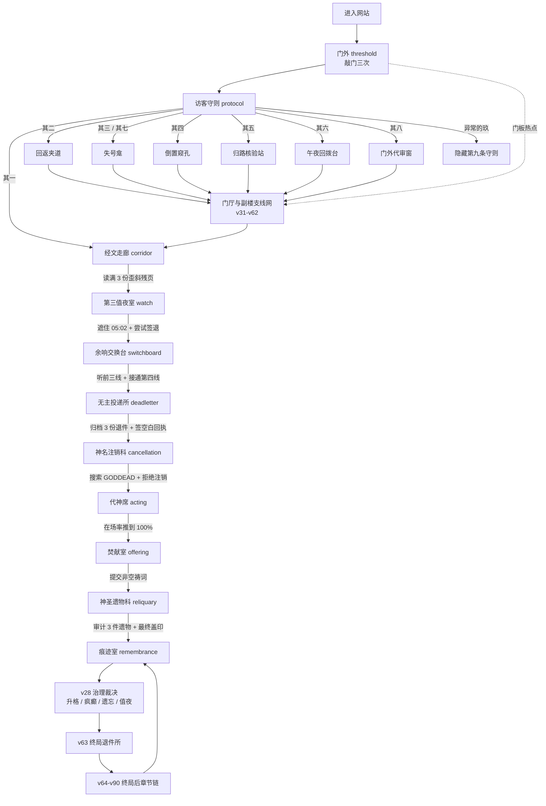
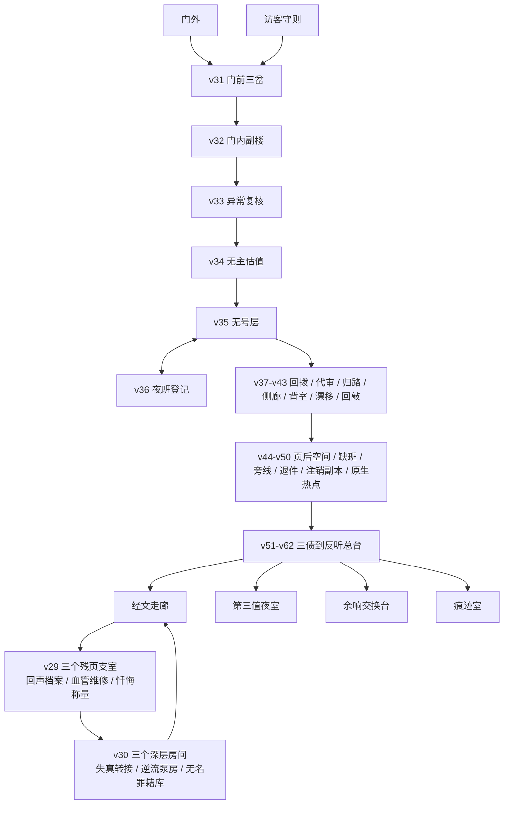
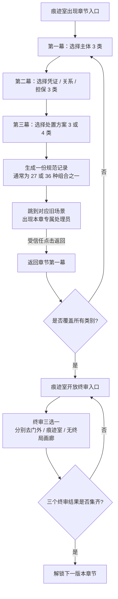
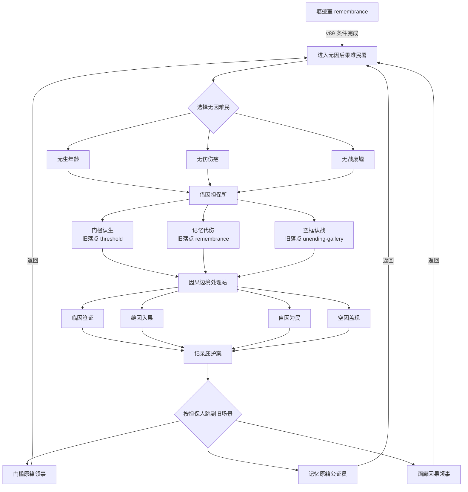

# Goddead 当前游玩流程图

版本基线：v90

场景总数：193
关键枢纽：`threshold`（门外）、`corridor`（经文走廊）、`remembrance`（痕迹室）、`unending-gallery`（无终局画廊）

这份文档按玩家实际体验拆成四层：基础主线、门厅支线网、终局后章节链、当前最新 v90。源码里的 193 个场景并不是一条直线；`remembrance` 是后半程章节入口与终审入口的总枢纽，多个旧场景会在新章节中被重新征用为回桥。

## 1. 一眼看懂整局

## 2. 基础主线怎么走

1. 在 `threshold` 连续完成三次敲门。第三次后门体开启，自动进入 `protocol`。
2. `protocol` 的八条守则已经变成真实分流器。想走最短主线选“其一”；其二至其八会进入门厅支线、核验、回拨或代审系统；异常数字“玖”进入隐藏场景，不参与自动循环。
3. 到 `corridor` 后读满三份残页，解锁 `watch`。残页上的回声、血管、忏悔还会开启 v29 三个可选支室。
4. 在 `watch` 同时满足“处理 05:02 交班记录”和“至少尝试签退一次”，第四线路才会出现。
5. `switchboard` 先听完前三条回拨，再接通第四线；`deadletter` 归档三份退件并签收空白件；`cancellation` 搜索 `GODDEAD` 后拒绝注销；`acting` 把在场率推到 100%。
6. `offering` 接受一条非空祷词后点燃焚化炉；`reliquary` 完成三件遗物审计与最终盖印，进入 `remembrance`。
7. `remembrance` 会显示已经开放的章节、图鉴、旧场景回桥和终审入口。后半程游玩基本都从这里出发，再回到这里结算。

## 3. 门厅与副楼支线网（v29-v62）

这部分以探索、重复轮次、条件回流为主。v29-v30 是走廊残页下面的三条纵深支线；v31 起把门外、守则板、夹道、副楼和值班系统织成一张可循环网络。多数支线不会卡住基础主线，但会留下独立存档、目录入口和痕迹记录。

### 支线版本索引

| 版本 | 玩家主要在做什么 | 结果与回流 |
| --- | --- | --- |
| v29 前段多分支 | 从回声、血管、忏悔三份残页进入三个支室 | 返回门外、守则或走廊；访问记录永久保留 |
| v30 深层互联 | 从三个支室继续深入转接室、泵房、罪籍库 | 三个深层房间互相连通，并按值夜室解锁状态回流 |
| v31 门前三岔 | 点击门板日蚀、符号、回来痕迹，或使用守则分流 | 建立倒置窥孔、失号龛、回返夹道三角网 |
| v32 门内副楼 | 从 v31 的三个场景各进入一层副楼 | 闭目档案、无号前厅、逆向阶井继续互联 |
| v33 异常复核 | 三个案卷各作“异常 / 原案”判断 | 3 分进保全库，2 分回入口，0-1 分进误报井 |
| v34 无主估值 | 估值三件遗物，管理估值额与封印完整 | 达标进定额电梯；不足或破封走不同回流 |
| v35 无号层 | 在无铃病房、渗水档案、逆照洗衣中完成两间值班 | 按 `signal - debt` 分成高位、复核、债务三档 |
| v36 夜班登记 | 每轮领取静音铃、空白名或逆向证之一 | 修改 v35 的信号 / 门债，使三档都能正常到达 |
| v37 午夜回拨 | 接两条夜线，并去相应值班房现场回报 | 两线组合决定去复核、窥孔或回返夹道 |
| v38 门外代审 | 审问三名夜访者并逐一裁定 | 由裁定结果把玩家送回门厅网络 |
| v39 归路核验 | 选择两条归路并判断其证据 | 审核结果决定安全回流或异常路线 |
| v40 门外侧廊 | 从门左右两侧进入灯廊、影廊与铰链场景 | 横向接回门外、守则和内部网络 |
| v41 守则背室 | 从守则板进入三间后台房 | 为守则来源、空名和铃声建立更多回桥 |
| v42 守则漂移 | 连续检查四条漂移守则 | 正确连胜与误报分别改变返回位置 |
| v43 门内回敲网 | 在三个回敲场景处理反向敲击 | 把门外、守则和走廊再次串成闭环 |
| v44 页后空层 | 进入残页背后的纸页空间 | 扩大走廊残页的可探索纵深 |
| v45 未到交班 | 处理缺席的换班者与空位 | 将值夜、交班和回拨网络接回主线 |
| v46 旁线未静 | 重访回声、血管、忏悔的余响 | 旧支线获得新的听取与回应层 |
| v47 退件未止 | 追踪投递所退件留下的后续地址 | 连接退件、地址和返回线路 |
| v48 注销留副 | 处理注销后仍存在的副本 | 连接神名注销与身份副本网络 |
| v49 门前实感 | 在旧门厅画面上使用原生物件热点 | 旧场景从按钮清单转为画面内探索 |
| v50 副楼实感 | 在副楼画面上使用原生物件热点 | 为后续“三债”提供可触摸入口 |
| v51 副楼三债 | 在副楼动作中累积见证、失号、逆行三种债 | 每种债到阈值后显出专属异常入口 |
| v52 三债结算 | 对三种副楼债进行独立结算 | 将结果写回副楼网络，不改旧版本状态 |
| v53 归路信念污染 | 房间开始根据玩家过去路线“相信”出口 | 同一房间会因历史选择给出不同回流 |
| v54 迫近回访 | 离开视线后的房间发生位移 | 回访时用位置变化推进下一层异常 |
| v55 失常交班 | 无号层把异常作为交班记录上报 | 将房间状态送往证据与值班网络 |
| v56 症状交接 | 证据反过来审核见证人 | 形成症状、证据、见证三者的交接闭环 |
| v57 判词后果层 | 给裁决结果分配可承受它的“身体” | 裁决从文本变成可继续追踪的后果 |
| v58 异议总署 | 对前述判词提出和登记异议 | 将争议送入正式听证链 |
| v59 交叉听证 | 多份证词互相质询 | 产出可进入证物链的听证记录 |
| v60 证物链 | 为听证结果建立保管与流转顺序 | 证物去向决定后续故障重演入口 |
| v61 故障重演 | 重放一次失败的处理流程 | 把错误转成可监听、可追责的信号 |
| v62 反听总台 | 三条旧旁线各提交一次回应，组合成 27 种监听结果 | 结算后回到主网络；也成为 v63 无终局画廊的反向出口 |

## 4. 终局后章节链（v63-v90）

```mermaid
flowchart TD
    V28[v28 四类治理终局] --> V63[v63 终局退件所\n12 coda + 无终局]
    V63 --> V64[v64 因果倒邮\n12 后果 + 3 零号结局]
    V64 --> V65[v65 因果疤痕\n12 处理 + 3 病房结局]
    V65 --> V66[v66 反事实纺生]
    V66 --> V67[v67 无血家谱]
    V67 --> V68[v68 世代借贷]
    V68 --> V69[v69 死后人口普查]
    V69 --> V70[v70 亡者议会]
    V70 --> V71[v71 死亡外交部]
    V71 --> V72[v72 遗言中央银行]
    V72 --> V73[v73 梦境海关]
    V73 --> V74[v74 墓碑专利局]
    V74 --> V75[v75 末日保修局]
    V75 --> V76[v76 现实退款处]
    V76 --> V77[v77 自我真伪鉴定]
    V77 --> V78[v78 第一人称配给]
    V78 --> V79[v79 未言人格继承]
    V79 --> V80[v80 未遂思想收容]
    V80 --> V81[v81 后悔回收]
    V81 --> V82[v82 宽恕填埋]
    V82 --> V83[v83 伤害考古]
    V83 --> V84[v84 无罪证人保护]
    V84 --> V85[v85 孤事实认领]
    V85 --> V86[v86 存在放弃登记]
    V86 --> V87[v87 不存在债务催收]
    V87 --> V88[v88 未发生事件拍卖]
    V88 --> V89[v89 既成事实拆迁]
    V89 --> V90[v90 无因后果难民署]
```

### 后半程共通玩法

v66 之后的大多数章节都采用同一个可学习的循环：

玩家通常不需要先刷满全部 36 种组合：先用最少的代表记录覆盖所有第一、第二、第三层类别，就能开放本章终审；但下一章通常还要求本章三个终审结果全部集齐。图鉴全收集则需要补满本章全部组合。

| 版本段 | 组合规模 | 章节完成条件 | 场景数到达 |
| --- | ---: | --- | ---: |
| v63 | 4 个旧终局 × 3 种处理 = 12 | 四种旧终局各至少一份 coda，开放第 13 个“无终局” | 89 |
| v64 | 3 种邮寄模式 × 4 个旧落点 = 12，再加 3 个零号结局 | 四个落点都收到后果，再完成零号结局 | 92 |
| v65 | 4 个旧场景 × 3 种疤痕处理 = 12，再加 3 个病房结局 | 四处至少各处理一次，再完成病房裁定 | 93 |
| v66-v67 | 36 + 3 | 覆盖 4×3×3，再集齐三个终局 | 97 / 101 |
| v68-v69 | 27 + 3 | 覆盖 3×3×3，再集齐三个终局 | 105 / 109 |
| v70-v90 | 每章通常 36 + 3 | 覆盖 3×3×4，再集齐三个终审结果 | v70 113，之后每版 +4，v90 为 193 |

## 5. 当前最新章节 v90：无因后果难民署

### 解锁

v89 必须先完成至少 4 道腾退令，并覆盖 3 类租客、3 类危历史产权、4 种拆除方式；随后集齐三项最后居住权上诉结果。满足后，`remembrance` 才显示 v90 普通入口。

### 一份庇护案的完整闭环

### 终审

完成至少 4 份庇护案并覆盖 3 名难民、3 名担保人、4 种边境程序后，`remembrance` 开放 `final-asylum-tribunal-for-causeless-consequences`：

| 裁定 | 跳转结果 |
| --- | --- |
| 授予所有无因后果因果庇护 | `threshold` |
| 遣返所有后果至原因之前 | `remembrance` |
| 认定所有后果为其原因的祖先 | `unending-gallery` |

三项裁定都完成后，v90 主体闭环结束，并留下 v91“倒生原因助产院”的叙事活口。

## 6. 游玩时最容易卡住的地方

- 直接输入尚未解锁的深层 hash 会被守卫改写到安全场景；后半程大多数新章节会回到 `remembrance`。
- 每份后半程记录都要在对应旧场景点击本章专属处理员，才算真正闭环；只到达旧场景还不算返回完成。
- 覆盖条件看的是“类别齐全”，不是简单做四次同一种组合。四份代表记录要刻意覆盖所有三组选择。
- 下一章通常同时检查“代表组合覆盖”和“本章三个终审结果”；只完成一次喜欢的结局，入口仍不会出现。
- 各版本使用独立 `localStorage` 键，坏档会回安全默认值；“遗忘并重新开始”会清掉整站进度。
- `玖`、门厅支线与 v29-v62 网络主要负责探索和世界扩展，不会替代基础主线的值夜、第四线、投递、注销、代神、焚献和遗物链。
